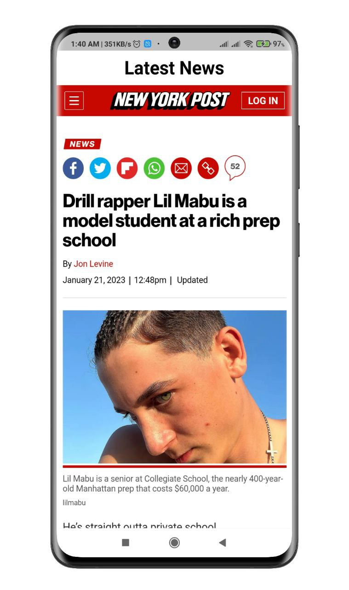

# News App

Popular latest news articles can read through this application. There are seven category news that can simply access anyone. Not only that, whenever user click on a specified articles, it goes to the specified news website. Webview is also used.
## Screenshots

<p align="center">
  
  
</p>


## Features
- Latest news
- Category selection


## Setup

Clone the repository

```bash
  git clone https://github.com/muradhossin/news_app.git
```
Move to the desired folder

```bash
  cd \news_app.git
```
To run the app, simply write

```bash
  flutter pub get
```
```bash
  flutter run
```
## Tech Stack

**Built With:** Dart, Flutter

**State Management:** Provider

**API:** Rest API


## Platform

- Android


## Contributing

Contributions are always welcome!

See `contributing.md` for ways to get started.

Please adhere to this project's `code of conduct`.


## License

[MIT](https://choosealicense.com/licenses/mit/)


## Support

For support, please contact here [](https://linkedin.com/in/md-murad-hossin)

  💰 You can help me by Donating
  [](https://buymeacoffee.com/muradhossin) 
